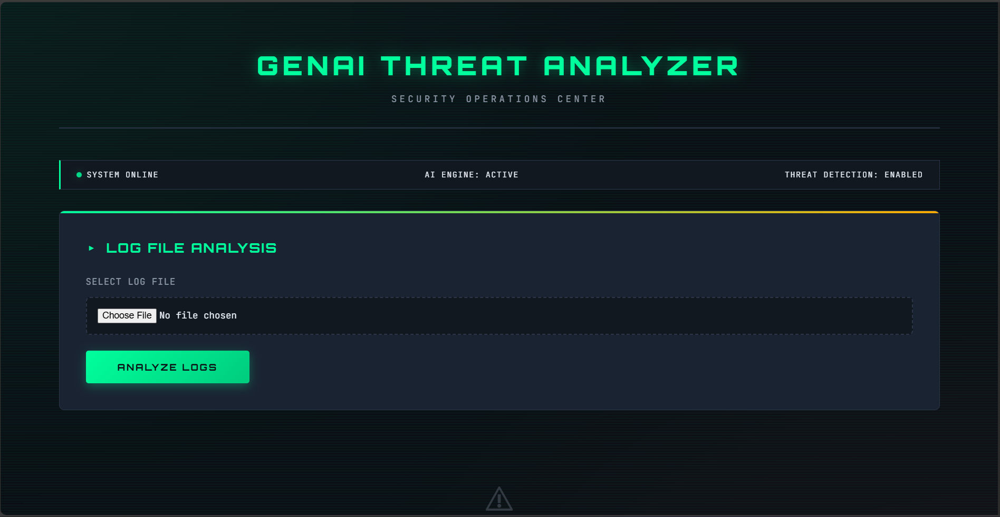
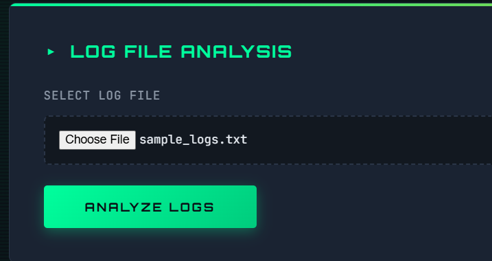
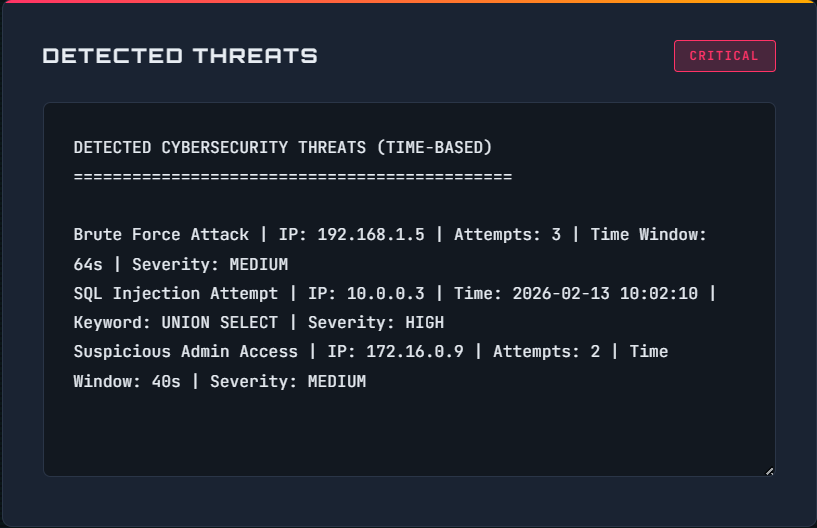
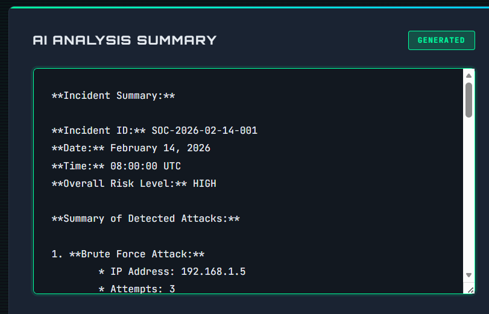
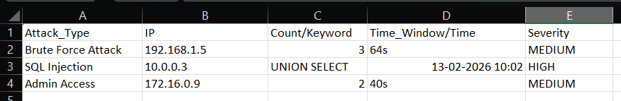

# 🔐 GenAI Cybersecurity Threat Analyzer

An AI-powered cybersecurity log analysis system that detects common cyber threats and automatically generates professional SOC-style incident summaries using Groq's LLaMA 3.1 model.

---

## 🚀 Features

- 📂 Log file upload via web interface
- 🔎 Brute force attack detection
- 💉 SQL injection detection
- 🔐 Suspicious admin access detection
- ⏱ Timestamp-based threat analysis
- 📊 SIEM-compatible CSV export
- 🤖 AI-powered incident summary generation
- 🌐 Flask-based SOC dashboard UI
- 🔐 Secure API key handling using `.env`

---

---

## 🖼 Project Demo

### 🔹 1. Web UI Homepage

### 🔹 2. Uploading Log File

### 🔹 3. Detected Threats

### 🔹 4. AI-Generated Incident Summary

### 🔹 5. SIEM-Compatible CSV Output

---

## 🛠 Tech Stack

- Python
- Flask
- Groq API (LLaMA 3.1)
- Regex-based log parsing
- HTML & CSS
- Git & GitHub

---

## 📂 Project Structure

